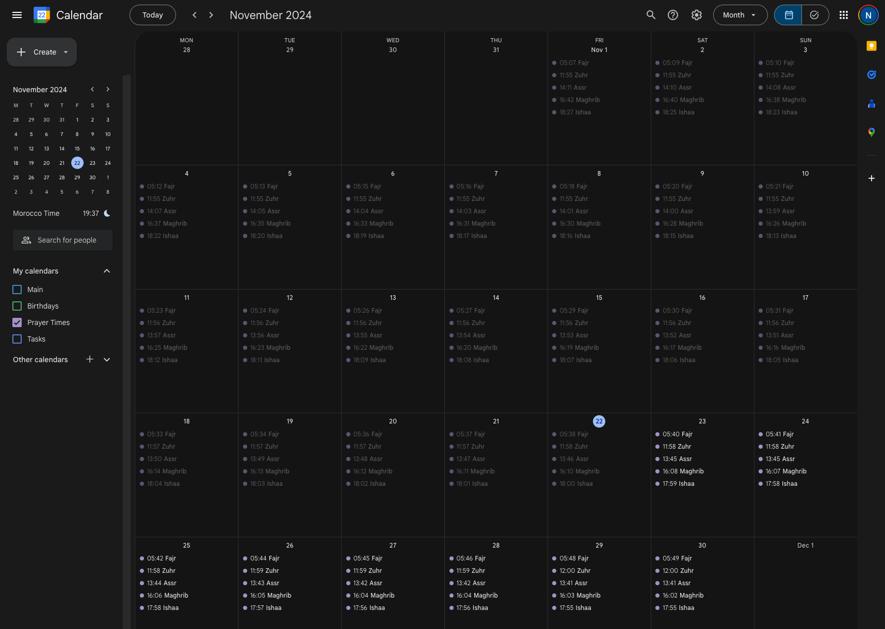

# Google Calendar Prayer Times

A script that fetches the Islamic prayer times from [prayer-times-api.izaachen.de](https://prayer-times-api.izaachen.de) (for Germany) and [api.aladhan.com](https://aladhan.com/) (for Morocco) and creates current months' prayer times in a specific Google Calendar using Google's Service Account crendentials (for each country).

> **Note:** This script was tested and used with Python 3.12

Preview:



## Setup

### For local usage

1. Follow this [guide](./docs/Google_Calendar_API_Service_Account.md) to generate the credentials (save the JSON file as `service-account.json`).
2. Create a `.env` file based on the sample.
3. Run the script as specified below in `Run` step.

### For GitHub Actions

1. Follow this [guide](./docs/Google_Calendar_API_Service_Account.md) to generate the credentials.
2. Create a GitHub Actions repository secret named `SERVICE_ACCOUNT_FILE_CONTENT` and paste the JSON credentials content into it.
3. Create a GitHub Actions repository secret named `ENV_FILE_CONTENT` and populate it with the same content as in the sample file (`.env.sample`).
4. Either run manually or wait until scheduled time.

## Run

Install dependencies:

```shell
poetry install
```

Run the script:

```shell
python src/script.py
```

## Development

Format:

```shell
make format
```

Lint:

```shell
make lint
```
